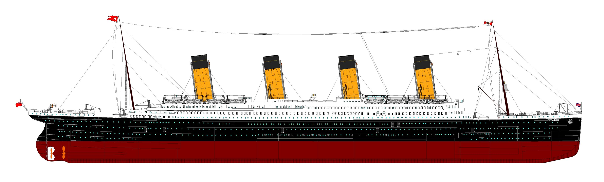
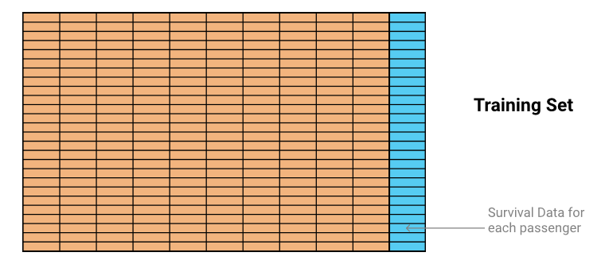
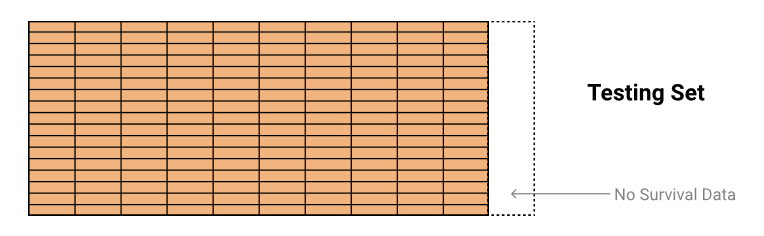

<!---
```{r setup, include = FALSE}
knitr::opts_chunk$set(echo = TRUE)
```
--->

# Table of contents #

1. [Introduction](#introduction)
    1. [Context](#context)
    2. [Challenge](#challenge)
    3. [Evaluation](#evaluation)
    4. [Data](#data)
    5. [Packages](#packages)
    
2. [Data understanding](#data_understanding)
    1. [Importing data](#importing_data)
    2. [Checking data](#checking_data)
    3. [Describing data](#describing_data)
    
3. [Data preparation](#data_preparation)

4. [Modeling](#modeling)

5. [Evaluation](#evaluation)

6. [Conclusions](#conclusions)


# 1. Introduction <a name="introduction"></a> #

[**Titanic: Machine Learning from Disaster - Kaggle**](https://www.kaggle.com/c/titanic)

The first step of every data project is to have a **clear understanding of the problem** we are trying to solve. In this section we describe the **goal** of the competition and its **rules** and briefly describe the available data.

## 1.1. Context <a name="context"></a> ##



_The sinking of the **RMS Titanic** is one of the most infamous shipwrecks in history.  On **April 15, 1912**, during her maiden voyage, the Titanic sank after colliding with an iceberg, **killing 1.502 out of 2.224 passengers and crew**. This sensational tragedy shocked the international community and led to better safety regulations for ships._

_One of the reasons that the shipwreck led to such loss of life was that there were not enough lifeboats for the passengers and crew. Although there was some element of luck involved in surviving the sinking, **some groups of people were more likely to survive than others**, such as women, children, and the upper-class._

[Sinking of the RMS _Titanic_ - Wikipedia](https://en.wikipedia.org/wiki/Sinking_of_the_RMS_Titanic)

[Titanic sinking - National Geographic](https://www.youtube.com/watch?v=9xoqXVjBEF8)

## 1.2. Challenge <a name="challenge"></a> ##

The goal of this competition is to complete the analysis of what sorts of people were likely to survive the sinking. In particular, to apply the tools of machine learning to **predict which passengers survived the tragedy**.

This is a **classification** problem, specifically, a [binary classification](https://en.wikipedia.org/wiki/Binary_classification) problem, because there are only two different states we are classifying.

## 1.3. Evaluation <a name="evaluation"></a> ##

### Goal ###

The goal is to **predict if a passenger survived the sinking of the Titanic or not**.
For each PassengerId in the test set, the model must predict a 0 or 1 value for the Survived variable.

### Metric ###

The score is the **percentage of passengers correctly predicted**. This is known simply as "accuracy”.

### Submission File Format ###

The submission file should be a **csv** file with exactly **418 entries** plus a header row. Submission will show an error if the file has extra columns (beyond PassengerId and Survived) or rows.

The file should have exactly 2 columns:

* **PassengerId** (sorted in any order)
* **Survived** (contains your binary predictions: 1 for survived, 0 for deceased)


```
PassengerId,Survived
 892,0
 893,1
 894,0
 Etc.
```

## 1.4. Data <a name="data"></a> ##

### Overview ###

The data has been split into two groups:

* **Training set** (train.csv)
* **Test set** (test.csv)

The **training set** should be used to build the machine learning models. For the training set, each passenger has an outcome (also known as the “ground truth”). The model will be based on “features” like passengers’ gender and class. It is possible to create **new features** using [feature engineering](https://triangleinequality.wordpress.com/2013/09/08/basic-feature-engineering-with-the-titanic-data/).



The **test set** should be used to see how well the model performs on unseen data. For the test set, the ground truth for each passenger is not provided. The goal is to **predict**, for each passenger in the test set, whether or not they survived the sinking of the Titanic.



The **gender_submission.csv** file is a set of predictions that assume all and only female passengers survive, as an example of what a submission file should look like.

### Data dictionary ###

**Variable**: Definition - Key

* **survival**: Survival - (0 = No, 1 = Yes)
* **pclass**: Ticket class - (1 = 1st, 2 = 2nd, 3 = 3rd)
* **sex**: Sex 	
* **age**: Age in years 	
* **sibsp**: # of siblings / spouses aboard the Titanic 	
* **parch**: # of parents / children aboard the Titanic 	
* **ticket**: Ticket number 	
* **fare**: Passenger fare 	
* **cabin**: Cabin number 	
* **embarked**: Port of Embarkation - (C = Cherbourg, Q = Queenstown, S = Southampton)

### Variable notes ###

* **pclass**: A proxy for socio-economic status (SES)
    * 1st = Upper
    * 2nd = Middle
    * 3rd = Lower
* **age**: Age is fractional if less than 1. If the age is estimated, is it in the form of xx.5
* **sibsp**: The dataset defines family relations in this way...
    * Sibling = brother, sister, stepbrother, stepsister
    * Spouse = husband, wife (mistresses and fiancés were ignored)
* **parch**: The dataset defines family relations in this way...
    * Parent = mother, father
    * Child = daughter, son, stepdaughter, stepson (Some children travelled only with a nanny, therefore parch=0 for them).
    
## 1.5. Packages <a name="packages"></a> ##

We need to use several **R packages** for data manipulation, visualization, modeling, etc.
    
```{r message = FALSE, warning = FALSE}
# Load packages

library('dplyr') # Data manipulation
library('ggplot2') # Visualization
```
    
# 2. Data understanding <a name="data_understanding"></a> #

The second step is to **know the details of the data** we have available to solve the problem. In this section we **load** the datasets, we **check consistency** and we **describe** them in detail. 

## 2.1. Importing data <a name="importing_data"></a> ##

```{r}
# Load train and test set preventing R to cast strings as factors

train <- read.csv('./data/train.csv', stringsAsFactors=FALSE)
test <- read.csv('./data/test.csv', stringsAsFactors=FALSE)

# Add type of set as a column

train$Set <- "train"
test$Set <- "test"

# Combine train and test sets. "Survived" is filled with NA for the test set

test$Survived <- NA
full <- rbind(train, test)
```

We combine the data from both the train and test set because, when performing **feature engineering**, it's useful to know the **full range of possible values** and the **distributions of all known values**. We added column `Set` to keep track of the training and test data.

## 2.2. Checking data <a name="checking_data"></a> ##

### Dimensions ###

```{r results='hide', message = FALSE, warning = FALSE}
# Check dimensions of imported sets

dim(train)
dim(test)
dim(full)
```

We confirm that the train set has **891 observations** and the test set has **418 observation** for a total of **1309 observations** as expected.

### Factors ###

We have to check if all the **categorical variables** are correctly set to [factors](https://www.stat.berkeley.edu/classes/s133/factors.html). 

```{r}
# Structure of the full set

str(full)
```

Because we imported the datasets with the `stringsAsFactors` parameter set to `FALSE`, we need to convert `Sex`, `Embarked` and `Set` variables **from string to factor**. We also convert `Survived` and `Pclass` variables **from int to factor**.

```{r}
# Cast variables to factor

factorize <- function(set, columns_to_factor) {
    set_factor <- set
    set_factor[columns_to_factor] <- lapply(select(set, one_of(columns_to_factor)), factor)
    return(set_factor)
}

columns_to_factor <- c("Survived", "Pclass", "Sex", "Embarked", "Set")

full <- factorize(full, columns_to_factor)
train <- factorize(train, columns_to_factor)
test <- factorize(test, columns_to_factor)
```

### Missing values ###

```{r}
# Summary of the full set

summary(full)
```

## 2.3. Describing data <a name="describing_data"></a> ##


# 3. Data preparation <a name="data_preparation"></a> #

# 4. Modeling <a name="modeling"></a> #

# 5. Evaluation <a name="evaluation"></a> #

# 6. Conclusions <a name="conclusions"></a> #
